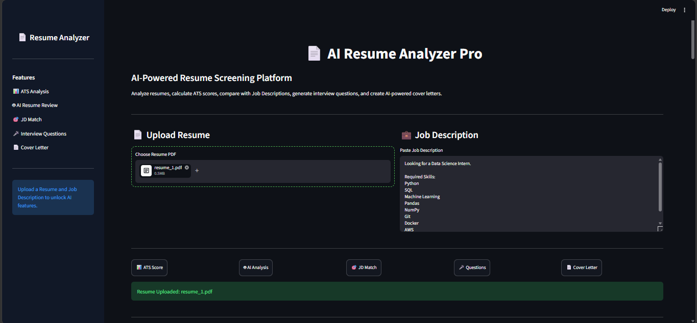
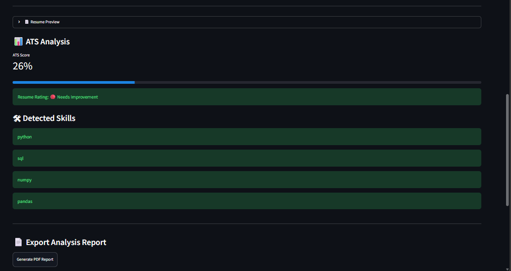
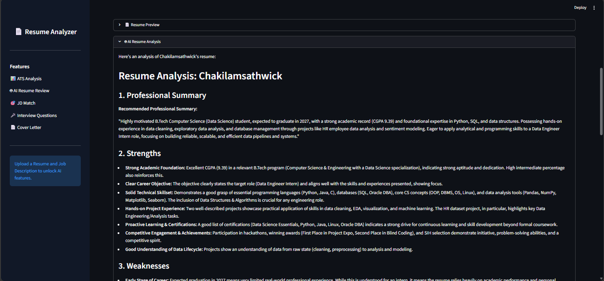
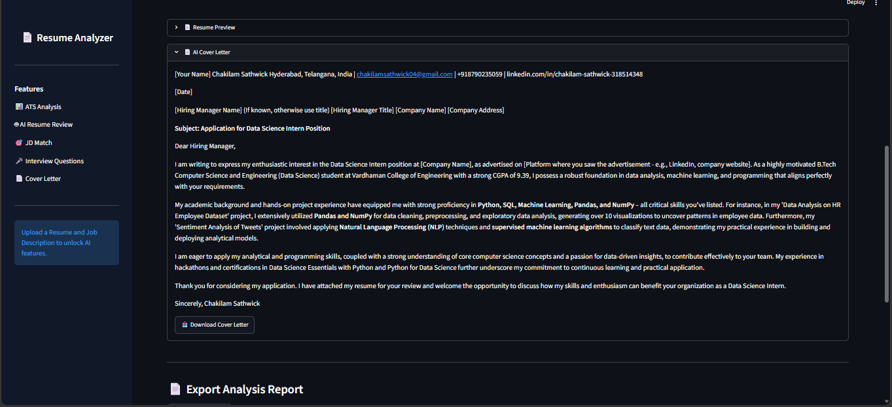
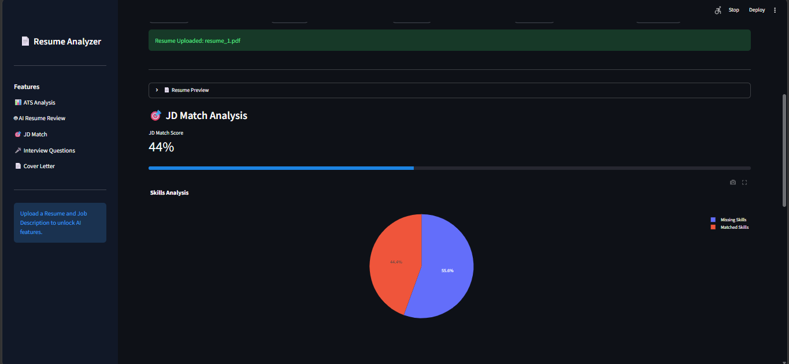

# 📄 AI Resume Analyzer Pro

An AI-powered Resume Analysis Platform that helps job seekers evaluate their resumes, compare them against job descriptions, identify missing skills, generate interview questions, create cover letters, and download detailed PDF reports.

---

## 🚀 Features

### 📊 ATS Score Analysis
- Calculates resume ATS score.
- Identifies detected skills.
- Provides resume strength rating.

### 🤖 AI Resume Analysis
- Uses Google Gemini AI.
- Generates:
  - Professional Summary
  - Strengths
  - Weaknesses
  - Improvement Suggestions

### 🎯 Job Description Matching
- Compares resume against job description.
- Calculates JD Match Score.
- Displays matched skills.
- Identifies missing skills.

### 🎤 AI Interview Questions
- Generates:
  - Technical Questions
  - HR Questions
  - Project-Based Questions

### 📄 AI Cover Letter Generator
- Creates personalized cover letters based on:
  - Resume
  - Job Description

### 📈 Interactive Dashboard
- ATS Score Visualization
- JD Match Visualization
- Skills Analysis Charts

### 📑 PDF Report Generation
- Download complete resume analysis report.
- Includes:
  - ATS Score
  - JD Match Score
  - Skills
  - AI Analysis

---

## 🛠 Tech Stack

### Frontend
- Streamlit

### Backend
- Python

### AI
- Google Gemini API

### Libraries
- PyPDF2
- Plotly
- ReportLab
- python-dotenv

### Version Control
- Git
- GitHub

---

## 📂 Project Structure

```text
ai-resume-analyzer/
│
├── app.py
│
├── requirements.txt
│
├── README.md
│
├── .gitignore
│
├── .env
│
└── src/
    │
    ├── pdf_parser.py
    ├── ats_score.py
    ├── gemini_helper.py
    ├── jd_matcher.py
    ├── interview_generator.py
    ├── cover_letter_generator.py
    ├── resume_rating.py
    ├── charts.py
    └── pdf_report.py
```

---

## 🏗 System Architecture

```text
Resume PDF
     │
     ▼
 PDF Parser
     │
     ▼
 Resume Text
     │
     ├────────────► ATS Engine
     │                  │
     │                  ▼
     │             ATS Score
     │
     ├────────────► JD Matcher
     │                  │
     │                  ▼
     │            Match Analysis
     │
     └────────────► Gemini AI
                        │
                        ├─ Resume Analysis
                        ├─ Interview Questions
                        └─ Cover Letter

Results
     │
     ├─ Streamlit Dashboard
     ├─ Charts
     └─ PDF Report
```

---

## 📸 Screenshots

### 🏠 Home Page



The landing page where users can upload their resume, paste a job description, and access all AI-powered features.

---

### 📊 ATS Score Analysis



Displays the ATS score, detected skills, resume rating, and provides insights into how well the resume is optimized for Applicant Tracking Systems.

---

### 🤖 AI Resume Analysis



Uses Google Gemini AI to analyze the resume and generate:
- Professional Summary
- Strengths
- Weaknesses
- Improvement Suggestions

---

### 📄 AI Cover Letter Generator



Generates a personalized and professional cover letter tailored to the uploaded resume and job description.

---

### 🎯 Job Description Match Analysis

#### JD Match Example 1



Compares the resume against a job description and identifies:
- Match Score
- Matching Skills
- Missing Skills

#### JD Match Example 2


Provides detailed skill gap analysis to help candidates understand what skills are required for a target role.

---

## ⚙ Installation

### Clone Repository

```bash
git clone https://github.com/chakilamsathwick/ai-resume-analyzer.git
```

### Navigate to Project

```bash
cd ai-resume-analyzer
```

### Create Virtual Environment

```bash
python -m venv .venv
```

### Activate Virtual Environment

Windows:

```bash
.venv\Scripts\activate
```

### Install Dependencies

```bash
pip install -r requirements.txt
```

### Add Gemini API Key

Create `.env`

```env
GEMINI_API_KEY=your_api_key_here
```

### Run Application

```bash
streamlit run app.py
```

---

## 🎯 Future Enhancements

- Multi-Resume Comparison
- Resume Ranking System
- Skill Gap Recommendations
- Resume Improvement Suggestions
- Deployment on Streamlit Cloud
- Recruiter Dashboard

---

## 👨‍💻 Author

**Chakilam Sathwick**

B.Tech Data Science

GitHub:
https://github.com/chakilamsathwick

---

## ⭐ If you found this project useful, give it a star!